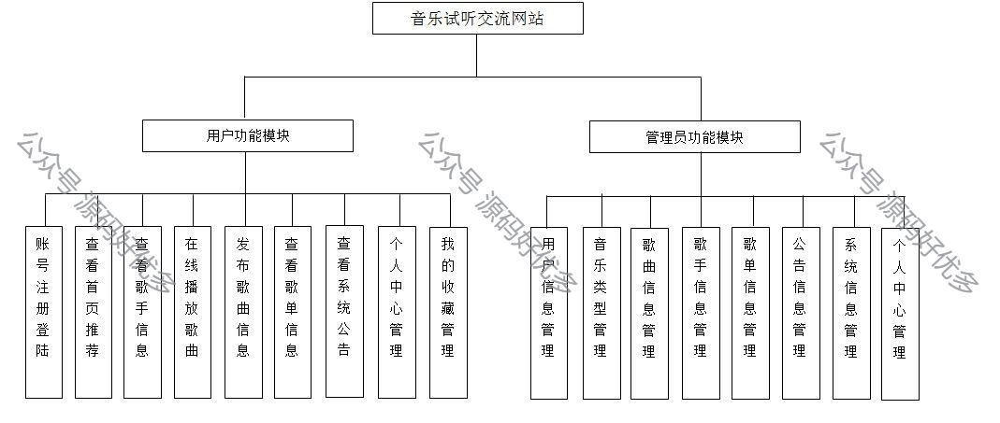
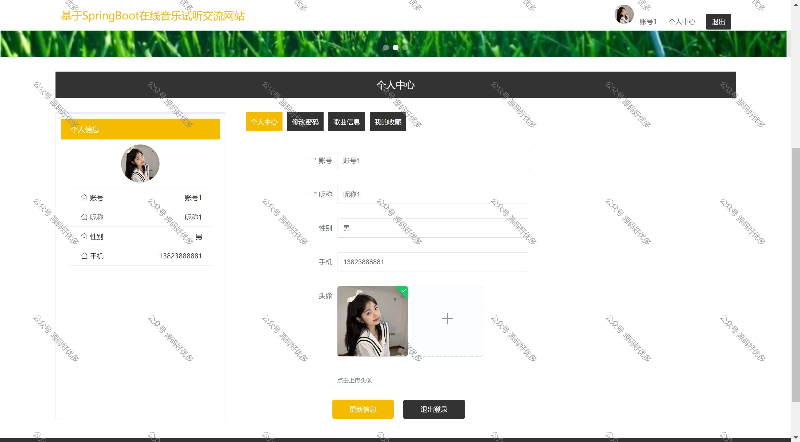
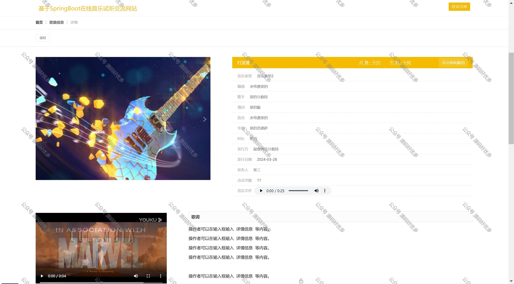
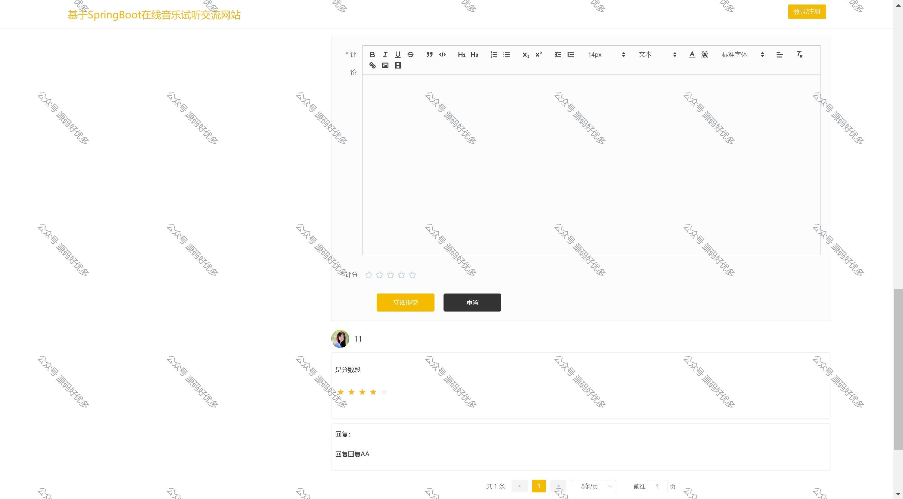
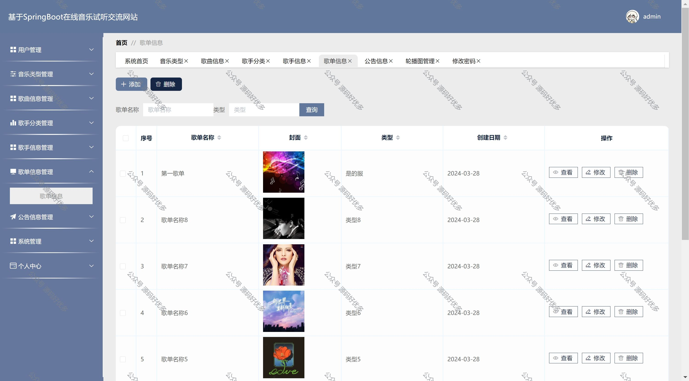
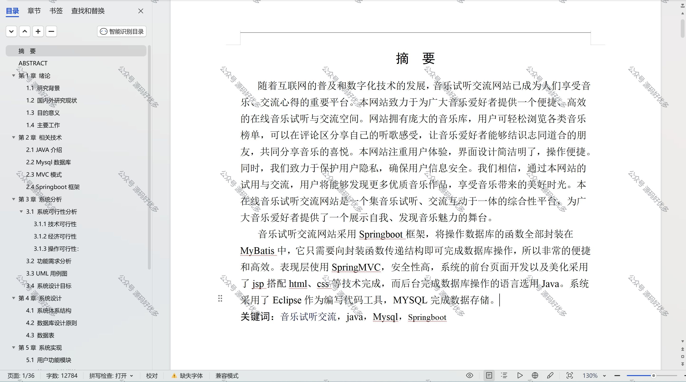

 
## 查看主页获取源码

> **作者介绍**： **✌**全网粉丝10W+本平台特邀作者、博客专家、CSDN新星计划导师、java领域优质创作者,博客之星、掘金/华为云/阿里云/InfoQ等平台优质作者、专注于项目实战 **✌**

  

### 一、作品包含

源码+数据库+设计文档万字+PPT+全套环境和工具资源+部署教程

### 二、项目技术

前端技术：Html、Css、Js、Vue

数据库：MySQL

后端技术：Java、Spring Boot、MyBatis

### 三、运行环境

开发工具：IDEA

数据库：MySQL8.0

数据库管理工具：Navicat10以上版本

环境配置软件： JDK1.8+Maven3.6.3

### 四、项目介绍
项目编号：springbootA050

随着互联网的普及和数字化技术的发展，音乐试听交流网站已成为人们享受音乐、交流心得的重要平台。本网站致力于为广大音乐爱好者提供一个便捷、高效的在线音乐试听与交流空间。网站拥有庞大的音乐库，用户可轻松浏览各类音乐榜单，可以在评论区分享自己的听歌感受，让音乐爱好者能够结识志同道合的朋友，共同分享音乐的喜悦。本网站注重用户体验，界面设计简洁明了，操作便捷。同时，我们致力于保护用户隐私，确保用户信息安全。我们相信，通过本网站的试用与交流，用户将能够发现更多优质音乐作品，享受音乐带来的美好时光。本在线音乐试听交流网站是一个集音乐试听、交流互动于一体的综合性平台，为广大音乐爱好者提供了一个展示自我、发现音乐魅力的舞台

### 五、运行截图

